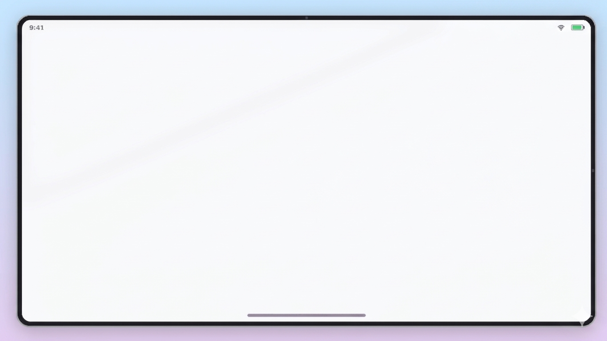
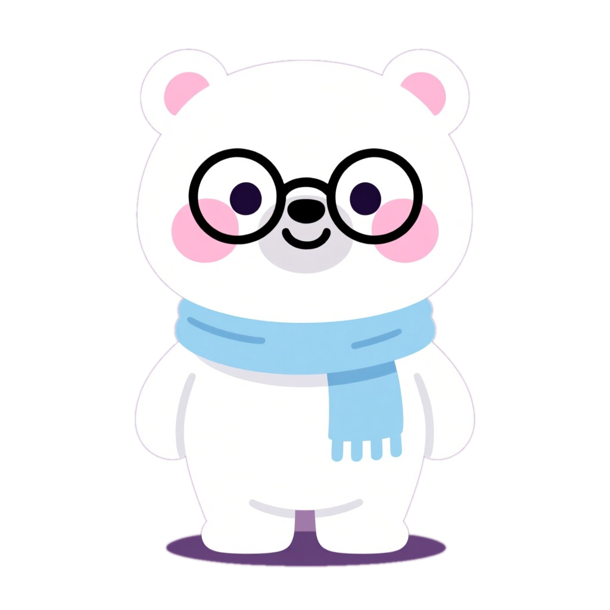

# iPadTemplate - iPad Pro 배경 래퍼 컴포넌트

AuroraBackground를 **대체**하는 커스텀 배경 컴포넌트.
**`references/background.png` 이미지를 배경으로 사용**하여 iPad Pro 프레임, 그라데이션 배경을 렌더링한다. 마스코트는 포함되어 있지 않으며 별도 Mascot 컴포넌트로 렌더링한다.
CSS로 iPad를 재현하지 않는다.

## 디자인 참조

### 완성 레이아웃


- 스카이블루 → 라벤더 그라디언트 배경
- iPad Pro 스타일 프레임 (둥근 모서리, 다크 베젤)
- 상태바: 9:41, WiFi 아이콘, 배터리 아이콘
- 홈 인디케이터 (하단 바)
- FaceID 카메라 (상단 중앙 노치)
### 마스코트 캐릭터


- 안경 쓴 북극곰, 파란 목도리
- 채널 시그니처 캐릭터
- **background.png에는 마스코트가 포함되어 있지 않다.** `references/mascot.png`를 별도 Mascot 컴포넌트로 렌더링한다.

## 핵심 원칙

> **반드시 `references/background.png`를 `` 태그로 배경에 깔고, iPad 화면 영역에 children을 absolute 배치한다.**
> CSS gradient나 SVG로 iPad 프레임을 직접 그리지 않는다.
> **screenTint는 `"transparent"` 기본값** — background.png에 이미 흰색 iPad 화면이 포함되어 있으므로 불투명 배경으로 덮지 않는다.
> **콘텐츠 영역은 1.15x 스케일** — iPad 스크린 내부에서 콘텐츠가 충분히 크게 보이도록 inner wrapper에 `transform: scale(1.15)`를 적용한다.

### 표준 레이아웃 (2026-04-22 확정)

모든 수치는 **iPad 스크린 로컬 좌표**(스크린 좌상단 0,0 기준, 크기 1842x1002) 기준이다.

| 요소 | 위치 | 크기 | 비고 |
|------|-----|-----|------|
| iPad 스크린 | `left: 39, top: 39` (글로벌) | 1842 × 1002 | background.png의 iPad 프레임 내부 영역 |
| 콘텐츠 inner wrapper | **`paddingTop: 90, paddingBottom: 90`** (대칭) | — | 콘텐츠 수직 중심이 스크린 정중앙(y=501)에 맞춰짐 |
| 콘텐츠 scale | `transform: scale(1.15)` | — | `transformOrigin: center center` |
| Mascot | `right: 20, bottom: 20` | `size: 180` | overlay prop으로 전달 (IPadTemplate children이 아닌 스크린 div 내부 오버레이) |
| TimedSubtitle | **`bottom: 12`**, `left: 50%, translateX(-50%)` | `max-width: 1400` | 스크린 하단 가장자리에 밀착 |

**변경 이력 (2026-04-22)**:
- 기존 `paddingBottom: 180` 비대칭 패딩 → **`paddingTop: 90, paddingBottom: 90` 대칭**. 비대칭 패딩은 자막 safe area를 확보하는 목적이었으나, 콘텐츠가 스크린 정중앙에서 90px 위로 치우치는 문제가 발생. 자막 위치를 스크린 하단(`bottom: 12`)으로 밀착시키는 방식으로 대체.
- 기존 자막 `bottom: 40` → **`bottom: 12`**. 콘텐츠 박스와의 수직 겹침을 수십 px 이내로 줄이면서 콘텐츠는 스크린 정중앙 유지.
- Mascot 표준 위치(`right: 20, bottom: 20, size: 180`)는 유지. 내부 모서리 고정 원칙 불변.

> **⚠️ 마스코트는 모든 씬에서 표시가 기본이다.** intro/outro에서만 표시하고 콘텐츠 씬에서 숨기는 것은 안티패턴이다. `showBear={i === 0 || i === scenes.length - 1}` 패턴 사용 금지.
> **자막과 마스코트 겹침 방지**: 자막 `max-width: 1400`이면 자막 우측 끝이 스크린 중앙 근처에 위치하므로, 우하단 Mascot(180px)과 수평으로 겹치지 않는다. 자막은 `left: 50%, translateX(-50%)`로 중앙 정렬되어 Mascot과 독립된 영역을 차지한다.

### 콘텐츠 세로 높이 제한

대칭 패딩(`paddingTop: 90, paddingBottom: 90`)을 적용하면:

- iPad 스크린 실 가용 높이: `1002 - 90 - 90 = 822px`
- inner `scale(1.15)` 보정 후 콘텐츠 실 사용 영역: **≈720px**
- 이 한도를 넘는 비주얼은 iPad 프레임 위아래로 잘리거나 자막(y=~912~984)과 겹친다

자막은 스크린 로컬 y 912~984에 위치(bottom 12 + padding 14+14 + fontSize 34 + line-height 1.4 ≈ 높이 72). 콘텐츠 하단(y=912)이 자막 상단과 거의 맞닿으므로, 콘텐츠 실 높이가 720px을 넘으면 반드시 축소한다.

**해결 패턴 — transform scale + 대칭 음수 마진**:

```tsx
<div style={{
  transform: "scale(0.85)",
  transformOrigin: "center center",  // 반드시 center — "top center"면 콘텐츠가 위로 쏠려 하단이 비고 자막과 멀어진다
  marginTop: -overflow/2,
  marginBottom: -overflow/2,  // overflow = 원본높이 × (1 - scale)
}}>
  <HeavyDiagram />
</div>
```

자세한 수치·예시(react-loop, quadrant-matrix, timeline-cards)는 `component-patterns.md`의 **iPad 제약에 맞춘 축소 스펙** 섹션 참조.

## iPad 화면 영역 좌표

background.png는 1280x720 이미지. 영상은 1920x1080 (1.5x 스케일).

| 항목 | 1280x720 원본 | 1920x1080 스케일 |
|------|--------------|-----------------|
| 화면 좌상단 | (26, 26) | (39, 39) |
| 화면 크기 | 1228 x 668 | 1842 x 1002 |

`Img`에 `objectFit: "cover"`를 적용하면 자동으로 1920x1080에 맞게 스케일된다.

## 컴포넌트 코드

### IPadTemplate.tsx

```tsx
import React from "react";
import {
  AbsoluteFill,
  Img,
  interpolate,
  spring,
  useCurrentFrame,
  useVideoConfig,
  staticFile,
} from "remotion";

export const IPadTemplate: React.FC<{
  children: React.ReactNode;
  screenTint?: string;
  overlay?: React.ReactNode;
}> = ({ children, screenTint, overlay }) => {
  const frame = useCurrentFrame();
  const { fps } = useVideoConfig();

  // Content entrance animation
  const contentSpring = spring({
    frame,
    fps,
    config: { damping: 14, stiffness: 80, mass: 1 },
  });
  const contentOpacity = interpolate(frame, [0, 0.3 * fps], [0, 1], {
    extrapolateLeft: "clamp",
    extrapolateRight: "clamp",
  });
  const contentScale = interpolate(contentSpring, [0, 1], [0.95, 1]);

  // background.png 1365x768 → 1920x1080 (동일 16:9 비율)
  // iPad 화면 영역: 1280x720 기준 (26,26) 1228x668 → 1920x1080 스케일
  const SCREEN_LEFT = 39;
  const SCREEN_TOP = 39;
  const SCREEN_WIDTH = 1842;
  const SCREEN_HEIGHT = 1002;

  return (
    <AbsoluteFill>
      {/* background.png: iPad frame + gradient bg — 전체 화면 꽉 채움 */}
      

      {/* iPad screen content area */}
      <div
        style={{
          position: "absolute",
          left: SCREEN_LEFT,
          top: SCREEN_TOP,
          width: SCREEN_WIDTH,
          height: SCREEN_HEIGHT,
          borderRadius: 16,
          background: screenTint || "transparent",
          overflow: "hidden",
          opacity: contentOpacity,
          transform: `scale(${contentScale})`,
          transformOrigin: "center center",
        }}
      >
        {/* 콘텐츠 1.15x 스케일 — 상/하 90px 대칭 패딩으로 스크린 정중앙 정렬 (y=501) */}
        <div
          style={{
            position: "absolute",
            inset: 0,
            paddingTop: 90,
            paddingBottom: 90,
            display: "flex",
            alignItems: "center",
            justifyContent: "center",
            boxSizing: "border-box",
          }}
        >
          <div
            style={{
              width: "100%",
              height: "100%",
              display: "flex",
              alignItems: "center",
              justifyContent: "center",
              transform: "scale(1.15)",
              transformOrigin: "center center",
            }}
          >
            {children}
          </div>
        </div>

        {/* iPad 스크린 내부 오버레이 (자막·마스코트 등) */}
        {overlay}
      </div>
    </AbsoluteFill>
  );
};
```

### TimedSubtitle.tsx (표준 좌표)

```tsx
<div
  style={{
    position: "absolute",
    bottom: 12,          // 스크린 하단 가장자리 밀착
    left: "50%",
    transform: "translateX(-50%)",
    maxWidth: 1400,
    width: "max-content",
    zIndex: 50,
    pointerEvents: "none",
  }}
>
  <div style={{
    background: "rgba(0, 0, 0, 0.78)",
    backdropFilter: "blur(10px)",
    borderRadius: 12,
    padding: "14px 36px",
    maxWidth: 1400,
    border: "1px solid rgba(255, 255, 255, 0.08)",
  }}>
    <span style={{ color: "#fff", fontSize: 34, fontFamily: "'CookieRun', sans-serif", fontWeight: 500 }}>
      {currentText}
    </span>
  </div>
</div>
```

### Mascot.tsx (표준 좌표)

```tsx
<div
  style={{
    position: "absolute",
    right: 20,            // 스크린 내부 우측 가장자리
    bottom: 20,           // 스크린 내부 하단 가장자리
    width: 180,           // 표준 크기
    height: 180,
    zIndex: 100,
  }}
>
  
</div>
```

## 필수 에셋 복사

```bash
# ⚠️ 필수 에셋: 반드시 references/ 폴더에서만 복사할 것
# 프로젝트의 background/ 폴더나 다른 경로의 파일을 사용하지 않는다.
cp ~/.claude/skills/remotion-assembly/references/background.png public/images/background.png
cp ~/.claude/skills/remotion-assembly/references/mascot.png public/images/mascot.png
```

> **마스코트는 background.png에 포함되어 있지 않다.** Mascot 컴포넌트로 최상단 별도 레이어에 렌더링한다.
> **videoImageFormat은 반드시 'png'** — jpeg는 투명도를 지원하지 않아 마스코트 배경이 흰색으로 렌더링된다.

## MainVideo.tsx에서 사용하는 방법

iPadTemplate은 **AuroraBackground를 대체**한다. bgVariant, showBear 등의 props는 없다.
배경 이미지가 모든 비주얼을 처리하므로 `screenTint`만 선택적으로 전달한다.

**Mascot·TimedSubtitle은 `overlay` prop으로 전달**한다 (IPadTemplate children 밖이 아님). 이렇게 해야 iPad 스크린 내부에 absolute 배치되어 프레임 바깥으로 빠지지 않는다. 콘텐츠 1.15x 스케일의 영향을 받지 않도록 `overlay`는 스크린 div 내부에서 children과 별도 레이어로 렌더링된다.

```tsx
import { IPadTemplate } from "./components/IPadTemplate";
import { Mascot } from "./components/Mascot";
import { TimedSubtitle } from "./components/TimedSubtitle";

// ... scenes.map 내부:
<SceneWithFade durationInFrames={durationFrames} isFirst={i === 0} isLast={i === scenes.length - 1}>
  <IPadTemplate
    screenTint={scene.visual === "terminal-bg" ? "rgba(13,17,23,0.95)" : "transparent"}
    overlay={
      <>
        <Mascot size={180} />
        <TimedSubtitle narration={scene.narration} durationInFrames={durationFrames} />
      </>
    }
  >
    <SceneVisual scene={scene} />
  </IPadTemplate>
</SceneWithFade>
```

> **Mascot·TimedSubtitle 모두 `overlay` prop으로 전달**한다 — 내부 모서리 고정. IPadTemplate 바깥에 배치하면 프레임 밖으로 튀어나가는 시각 문제가 생긴다.
> **TimedSubtitle**은 narration을 문장 단위로 분리하여 글자 수 비율로 타이밍을 배분, TTS 음성과 동기화된 자막을 순차 표시한다.

## Props 레퍼런스

| Prop | 타입 | 기본값 | 설명 |
|------|------|--------|------|
| `children` | ReactNode | (필수) | iPad 스크린 안에 렌더링할 콘텐츠 |
| `screenTint` | string | `"transparent"` | 스크린 배경색 (기본 투명 — background.png의 흰색 iPad 화면이 비침. 어두운 콘텐츠면 `"#0d1117"` 등) |

## 모든 에셋 경로에 staticFile() 사용 필수

Remotion에서 public/ 디렉토리의 파일을 참조할 때는 반드시 `staticFile()`을 사용한다:

```tsx
// O — 올바른 사용

<Audio src={staticFile("audio/seg_00.wav")} />

// X — 렌더링 시 404 에러 발생

<Audio src="/audio/seg_00.wav" />
```

## 폰트 파일명 주의

public/fonts/ 디렉토리의 폰트 파일명에 **공백이 있으면 안 된다**:

```bash
# O — 올바른 파일명
CookieRunBold.otf
CookieRunRegular.otf

# X — 렌더링 시 404 에러 발생
CookieRun Bold.otf
CookieRun Regular.otf
```
